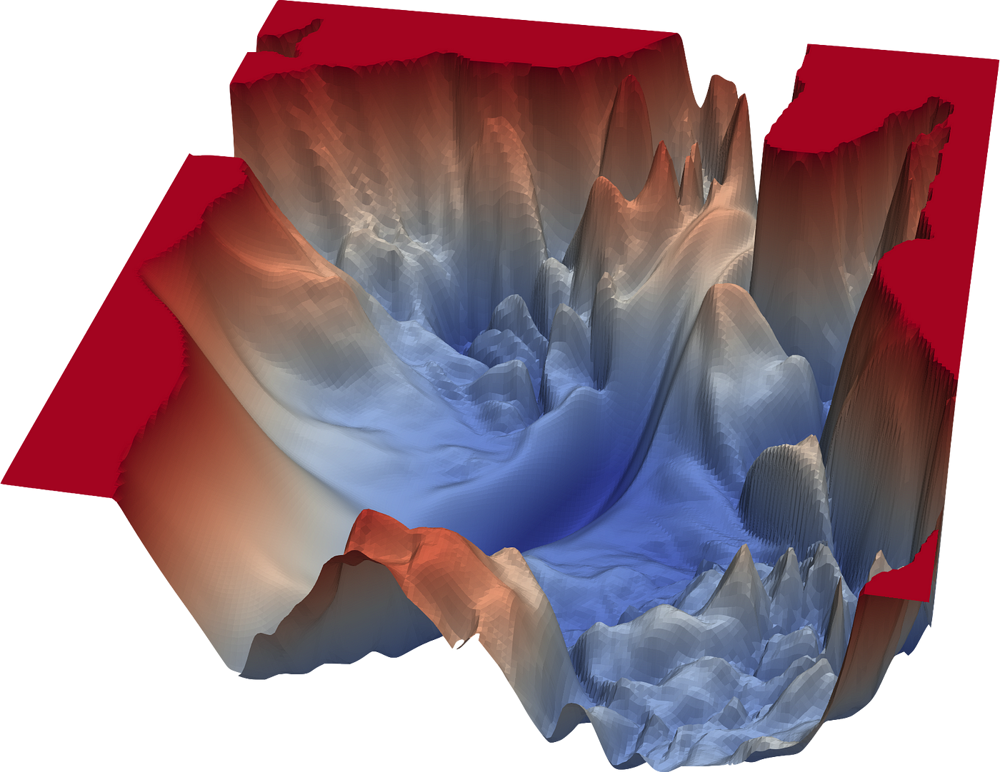

# evoGrad: An Automatic Gradient Engine

**evoGrad** is a lightweight automatic differentiation engine implemented from scratch. It serves as an educational tool to understand the fundamental concepts behind autograd and neural network operations.

<div style="text-align: center;">
  
</div>

## Features

- **Automatic Differentiation**: Tracks operations to build a computational graph and performs backpropagation to compute gradients.
- **Custom Value Class**: Represents scalar values with support for various arithmetic operations and gradient tracking.
- **Neural Network Components**: Includes basic components like Neurons, Layers, and a Multi-Layer Perceptron (MLP) for building neural networks.
- **Activation Functions**: Implements key activation functions such as Tanh and ReLU.

## Components

### Value Class

The core class that represents a scalar value and its gradient. Supports arithmetic operations like addition, multiplication, power, and exponential functions while maintaining the computational graph for gradient calculation.

### Module Class

A base class for all neural network components, providing methods to reset gradients and collect parameters.

### Neuron Class

Represents a single neuron with configurable nonlinearity. Each neuron performs a weighted sum of inputs followed by an optional activation function.

### Layer Class

A collection of neurons that forms a layer in the neural network. Supports forward passes through all neurons in the layer.

### MLP (Multi-Layer Perceptron) Class

Stacks multiple layers to form a fully connected neural network. Supports forward passes through all layers.

## Usage

evoGrad can be used to create and train simple neural networks. It is ideal for educational purposes and small-scale experiments to understand the mechanics of backpropagation and gradient-based optimization.

### Example Workflow

1. **Initialize an MLP**: Create a multi-layer perceptron with specified input size and layer configurations.
2. **Forward Pass**: Perform a forward pass with input data to get predictions.
3. **Backward Pass**: Calculate gradients via backpropagation.
4. **Update Parameters**: Adjust the network parameters based on gradients for training.

## Installation

Clone the repository to get started with evoGrad. No external dependencies are required.

```sh
git clone https://github.com/kanavgoyal898/evograd.git
```
---

## Conclusion

evoGrad is designed to provide an intuitive and clear understanding of the inner workings of automatic differentiation and neural network training. Happy learning!